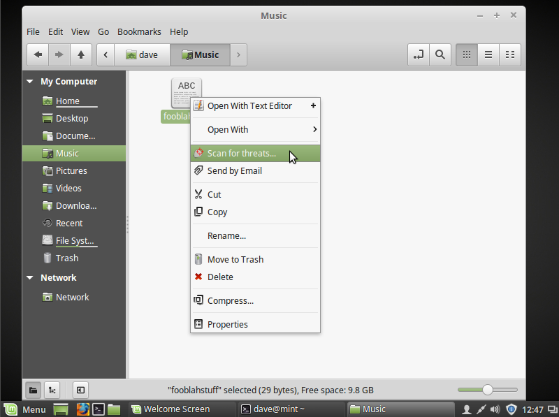

# README for nemo-sendto-clamtk

This readme file was last checked or updated 20240128.

## About

nemo-sendto-clamtk is a simple plugin for
[clamtk](https://github.com/dave-theunsub/clamtk) to allow a right-click, context menu scan of files or folders in nemo.

nemo-sendto-clamtk is available for Fedora, CentOS, and Debian|Ubuntu - or probably any system with nemo.  

All this plugin does is copy a desktop style file to the directory where nemo reads such things.  

  

### Installation

The good news is that this directory - /usr/share/nemo/actions/ - seems pretty standard across nemo installations. So, if you use a distribution using other than rpms or debs that I build, just copy the nemo-sendto-clamtk.nemo_action file from the source to /usr/share/nemo/actions/, like so:  

```sh
tar xf nemo-sendto-clamtk-0.08.tar.xz
cd nemo-sendto-clamtk-0.08
sudo cp nemo-sendto-clamtk.nemo_action /usr/share/nemo/actions/
```

Note that the file name may be different than the name you download due to the version number.

## Dependencies

You shouldn't be using such an old version of clamtk, but technically it would work with version 5.00 and up.  

clamtk >= 5.00
nemo  

## Important Links
  
For feature requests or bugs, it's best to use one of the following:

[Github clamtk-gnome](https://github.com/dave-theunsub/nemo-sendto-clamtk)  
[Gitlab clamtk-gnome](https://gitlab.com/dave_m/nemo-sendto-clamtk)  
[Github clamtk page](https://github.com/dave-theunsub/clamtk)  

## Contact

* Dave M, dave.nerd @gmail.com
  [0xC81DF0FAC4AFEB22](https://davem.fedorapeople.org/RPM-GPG-KEY-DaveM-20230506)
